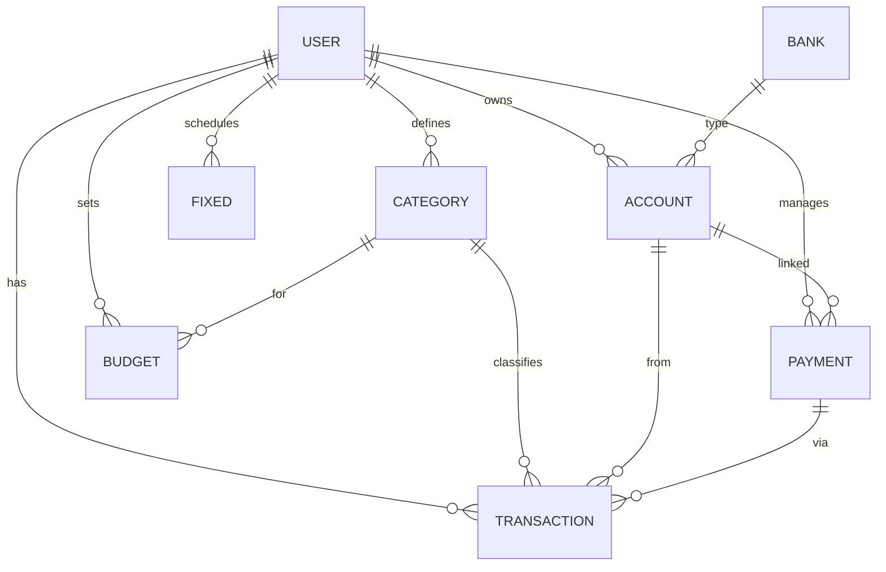
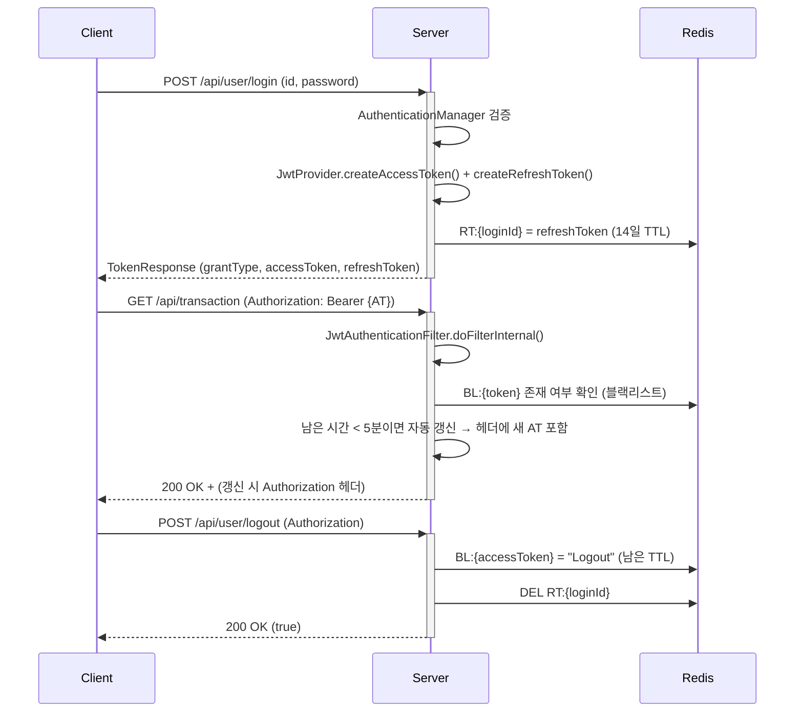

# MoneyLog 프로젝트 완전 분석 문서

> **최종 갱신**: 2026-02-11  
> **목적**: AI 코딩 어시스턴트가 프로젝트를 완벽히 이해하고, 어떤 요청에도 정확하게 대응하기 위한 참조 문서

---

## 1. 프로젝트 개요

**MoneyLog**는 사회 초년생을 위한 **스마트 가계부 웹 애플리케이션**입니다.

| 항목 | 내용 |
|---|---|
| **백엔드** | Spring Boot 3.5.8 / Java 17 |
| **프론트엔드** | React 19 + TypeScript + Vite 7 + TailwindCSS 4 |
| **DB** | MySQL 8.x (Main) + Redis (캐시/토큰) |
| **ORM** | JPA (메인) + MyBatis (복잡 쿼리) 혼용 |
| **인증** | JWT (Access + Refresh Token), Spring Security |
| **상태관리** | Zustand (sessionStorage persist) |
| **UI 라이브러리** | Radix UI + shadcn/ui + Recharts + Lucide Icons |
| **빌드** | Gradle (백엔드), Vite (프론트) |

---

## 2. 프로젝트 디렉토리 구조

```
MoneyLog/
├── src/
│   ├── main/java/com/moneylog_backend/
│   │   ├── MoneyLogApplication.java          # 메인 진입점
│   │   ├── global/                           # 공통 모듈
│   │   │   ├── aop/                          # AOP (메서드 로깅)
│   │   │   ├── auth/                         # 인증 (JWT, Security)
│   │   │   │   ├── annotation/LoginUser.java # @LoginUser 커스텀 어노테이션
│   │   │   │   ├── jwt/                      # JwtProvider, JwtAuthenticationFilter
│   │   │   │   └── security/                 # CustomUserDetails, CustomUserDetailsService
│   │   │   ├── common/BaseTime.java          # JPA Auditing (createdAt, updatedAt)
│   │   │   ├── config/                       # SecurityConfig, RedisConfig, BCryptEncoderConfig
│   │   │   ├── error/ErrorResponse.java      # 에러 응답 DTO
│   │   │   ├── exception/                    # GlobalExceptionHandler, ResourceNotFoundException
│   │   │   ├── file/FileStore.java           # 파일 업로드 처리
│   │   │   ├── log/                          # 로그 엔티티/리포지토리/이벤트리스너
│   │   │   ├── type/                         # Enum 정의 (7개)
│   │   │   └── util/                         # RedisService, FormatUtils, BankAccountNumberFormatter
│   │   └── moneylog/                         # 비즈니스 도메인
│   │       ├── user/                         # 회원 관리
│   │       ├── transaction/                  # 거래 내역 (핵심)
│   │       ├── account/                      # 자산(계좌) 관리
│   │       ├── category/                     # 카테고리 관리
│   │       ├── budget/                       # 예산 관리
│   │       ├── payment/                      # 결제수단 관리
│   │       ├── fixed/                        # 고정 지출 관리
│   │       ├── bank/                         # 은행 정보 (읽기 전용)
│   │       ├── schedule/                     # Quartz 스케줄러
│   │       └── file/                         # 파일 컨트롤러
│   ├── main/resources/
│   │   ├── application.yml                   # 설정 파일
│   │   ├── mappers/                          # MyBatis XML (6개)
│   │   └── sql/                              # schema.sql, data.sql
│   └── moneylog/                             # 프론트엔드 (Vite + React)
│       ├── src/
│       │   ├── App.tsx                        # 라우팅 정의
│       │   ├── main.jsx                       # React 진입점
│       │   ├── Pages/                         # 5개 페이지
│       │   ├── api/                           # Axios 설정 + API 모듈
│       │   ├── components/                    # UI 컴포넌트 (11개 주요 + 48개 ui)
│       │   ├── stores/                        # Zustand 스토어 (3개)
│       │   ├── types/                         # TypeScript 타입 정의
│       │   ├── styles/                        # CSS 스타일
│       │   └── utils/                         # 유틸리티
│       └── package.json
├── build.gradle                              # Gradle 빌드 설정
└── docs/                                     # 프로젝트 문서
```

---

## 3. 데이터베이스 스키마

### 3-1. 엔티티 관계도 (ERD)



### 3-2. 테이블 상세

#### USER (사용자)
| 컬럼 | 타입 | 설명 |
|---|---|---|
| `user_id` | INT UNSIGNED (PK) | Auto Increment |
| `account_id` | INT UNSIGNED (FK) | 기본 계좌 ID |
| `name` | VARCHAR(50) NOT NULL | 이름 |
| `id` (loginId) | VARCHAR(50) NOT NULL UNIQUE | 로그인 ID |
| `password` | VARCHAR(255) | BCrypt 해싱 |
| `email` | VARCHAR(100) NOT NULL UNIQUE | 이메일 |
| `phone` | VARCHAR(20) NOT NULL | 전화번호 |
| `gender` | BOOLEAN | 성별 |
| `role` | ENUM('ADMIN','USER') DEFAULT 'USER' | 권한 |
| `profile_image_url` | VARCHAR(255) | 프로필 이미지 |
| `status` | ENUM('ACTIVE','DORMANT','WITHDRAWN') DEFAULT 'ACTIVE' | 상태 |
| `provider` | ENUM('LOCAL','KAKAO','GOOGLE') DEFAULT 'LOCAL' | 소셜 로그인 |
| `provider_id` | VARCHAR(255) | 소셜 제공자 ID |
| `last_login_at` | DATETIME(6) | 마지막 로그인 |

#### TRANSACTION (거래 내역)
| 컬럼 | 타입 | 설명 |
|---|---|---|
| `transaction_id` | INT UNSIGNED (PK) | Auto Increment (100001~) |
| `user_id` | INT UNSIGNED NOT NULL (FK) | 소유자 |
| `category_id` | INT UNSIGNED NOT NULL (FK) | 카테고리 |
| `payment_id` | INT UNSIGNED (FK) | 결제수단 (지출 시) |
| `account_id` | INT UNSIGNED NOT NULL (FK) | 관련 계좌 |
| `fixed_id` | INT UNSIGNED (FK) | 고정 지출 참조 |
| `title` | VARCHAR(100) NOT NULL | 거래명 |
| `amount` | INT NOT NULL | 금액 |
| `memo` | TEXT | 메모 |
| `trading_at` | DATE NOT NULL | 거래일 |

#### ACCOUNT (계좌/자산)
| 컬럼 | 타입 | 설명 |
|---|---|---|
| `account_id` | INT UNSIGNED (PK) | Auto Increment (30001~) |
| `user_id` | INT UNSIGNED NOT NULL (FK) | 소유자 |
| `bank_id` | INT UNSIGNED (FK) | 은행 |
| `nickname` | VARCHAR(50) | 계좌 별명 |
| `balance` | INT | 잔액 |
| `account_number` | VARCHAR(50) | 계좌번호 |
| `color` | ENUM(12색) DEFAULT 'BLUE' | 표시 색상 |
| `type` | ENUM('BANK','CASH','POINT','OTHER') NOT NULL | 유형 |

#### CATEGORY (카테고리)
| 컬럼 | 타입 | 설명 |
|---|---|---|
| `category_id` | INT UNSIGNED (PK) | Auto Increment (10001~) |
| `user_id` | INT UNSIGNED NOT NULL | 소유자 |
| `name` | VARCHAR(50) NOT NULL | 카테고리명 |
| `type` | ENUM('INCOME','EXPENSE') NOT NULL | 수입/지출 |
| `color` | ENUM(12색) DEFAULT 'BLUE' | 표시 색상 |

#### BUDGET (예산)
| 컬럼 | 타입 | 설명 |
|---|---|---|
| `budget_id` | INT UNSIGNED (PK) | Auto Increment (40001~) |
| `user_id` | INT UNSIGNED NOT NULL | 소유자 |
| `category_id` | INT UNSIGNED NOT NULL | 대상 카테고리 |
| `amount` | INT NOT NULL | 예산 금액 |
| `budget_date` | DATE NOT NULL | 예산 기준 월 |

#### PAYMENT (결제수단)
| 컬럼 | 타입 | 설명 |
|---|---|---|
| `payment_id` | INT UNSIGNED (PK) | Auto Increment (20001~) |
| `user_id` | INT UNSIGNED NOT NULL | 소유자 |
| `account_id` | INT UNSIGNED (FK) | 연결 계좌 |
| `name` | VARCHAR(50) NOT NULL | 결제수단명 |
| `type` | ENUM('CASH','CREDIT_CARD','CHECK_CARD','BANK') NOT NULL | 유형 |

#### FIXED (고정 지출)
| 컬럼 | 타입 | 설명 |
|---|---|---|
| `fixed_id` | INT UNSIGNED (PK) | Auto Increment (50001~) |
| `user_id` | INT UNSIGNED NOT NULL | 소유자 |
| `category_id` | INT UNSIGNED NOT NULL | 카테고리 |
| `account_id` | INT UNSIGNED NOT NULL | 계좌 |
| `title` | VARCHAR(100) NOT NULL | 고정 지출명 |
| `amount` | INT NOT NULL | 금액 |
| `fixed_day` | INT NOT NULL | 매월 지출일 |
| `start_date` | DATE NOT NULL | 시작일 |
| `end_date` | DATE | 종료일 (null=무기한) |

#### BANK (은행 - 읽기 전용)
| 컬럼 | 타입 | 설명 |
|---|---|---|
| `bank_id` | INT UNSIGNED (PK) | Auto Increment (70001~) |
| `name` | VARCHAR(50) | 은행명 |
| `code` | VARCHAR(10) | 은행 코드 |
| `logo_image_url` | VARCHAR(255) | 로고 이미지 |

### 3-3. Auto Increment 시작 값
```
category: 10001, payment: 20001, account: 30001, budget: 40001,
fixed: 50001, transfer: 60001, bank: 70001, transaction: 100001
```

### 3-4. 인덱스
```sql
CREATE INDEX idx_transaction_user_date ON transaction(user_id, trading_at);
```

---

## 4. 백엔드 API 엔드포인트 전체 목록

### 4-1. 인증 (공개)
| HTTP | URL | Controller | 설명 |
|---|---|---|---|
| POST | `/api/user/signup` | UserController | 회원가입 (`@ModelAttribute`) |
| POST | `/api/user/login` | UserController | 로그인 (`LoginReqDto`) |
| POST | `/api/user/logout` | UserController | 로그아웃 |
| GET | `/api/user/info` | UserController | 사용자 정보 조회 |
| GET | `/api/bank` | BankController | 은행 목록 조회 (공개) |

### 4-2. 거래 내역 (인증 필요)
| HTTP | URL | Controller | 설명 |
|---|---|---|---|
| POST | `/api/transaction` | TransactionController | 거래 등록 (`@Valid TransactionReqDto`) |
| GET | `/api/transaction` | TransactionController | 당월 거래 목록 조회 |
| PUT | `/api/transaction` | TransactionController | 거래 수정 (`@Valid TransactionReqDto`) |
| DELETE | `/api/transaction?transactionId=` | TransactionController | 거래 삭제 |
| GET | `/api/transaction/calendar?year=&month=` | TransactionController | 캘린더 데이터 |
| GET | `/api/transaction/dashboard?year=&month=` | TransactionController | 대시보드 통계 |

### 4-3. 계좌/자산 (인증 필요)
| HTTP | URL | Controller | 설명 |
|---|---|---|---|
| POST | `/api/account` | AccountController | 계좌 등록 |
| GET | `/api/account?accountId=` | AccountController | 계좌 단건 조회 |
| GET | `/api/account/list` | AccountController | 계좌 목록 조회 |
| PUT | `/api/account` | AccountController | 계좌 수정 |
| DELETE | `/api/account?accountId=` | AccountController | 계좌 삭제 |
| PUT | `/api/account/transfer` | AccountController | 계좌 간 이체 |

### 4-4. 카테고리 (인증 필요)
| HTTP | URL | Controller | 설명 |
|---|---|---|---|
| POST | `/api/category` | CategoryController | 카테고리 등록 |
| GET | `/api/category` | CategoryController | 카테고리 목록 조회 |
| PUT | `/api/category` | CategoryController | 카테고리 수정 |
| DELETE | `/api/category?categoryId=` | CategoryController | 카테고리 삭제 |

### 4-5. 예산 (인증 필요)
| HTTP | URL | Controller | 설명 |
|---|---|---|---|
| POST | `/api/budget` | BudgetController | 예산 등록 |
| GET | `/api/budget` | BudgetController | 예산 목록 조회 |
| PUT | `/api/budget` | BudgetController | 예산 수정 |
| DELETE | `/api/budget?budgetId=` | BudgetController | 예산 삭제 |

### 4-6. 결제수단 (인증 필요)
| HTTP | URL | Controller | 설명 |
|---|---|---|---|
| POST | `/api/payment` | PaymentController | 결제수단 등록 |
| GET | `/api/payment` | PaymentController | 결제수단 목록 조회 |
| PUT | `/api/payment` | PaymentController | 결제수단 수정 |
| DELETE | `/api/payment?paymentId=` | PaymentController | 결제수단 삭제 |

### 4-7. 고정 지출 (인증 필요)
| HTTP | URL | Controller | 설명 |
|---|---|---|---|
| POST | `/api/fixed` | FixedController | 고정 지출 등록 |

---

## 5. 인증/보안 아키텍처

### 5-1. Security 설정
```
permitAll: /, /api/user/**, /api/bank
hasRole("ADMIN"): /admin/**
authenticated: 그 외 모든 요청
```

### 5-2. JWT 토큰 흐름


### 5-3. 토큰 만료 시간
| 토큰 | 만료 시간 |
|---|---|
| Access Token | 30분 (`1800초`) |
| Refresh Token | 14일 (`1209600초`) |

### 5-4. @LoginUser 어노테이션
- `JwtAuthenticationFilter`가 `SecurityContextHolder`에 `Authentication` 객체를 저장
- `@LoginUser Integer userId` → `CustomUserDetails`에서 `userId`를 추출하는 커스텀 `HandlerMethodArgumentResolver`

---

## 6. 백엔드 레이어 아키텍처

### 6-1. 도메인별 패키지 구조 (모든 도메인 동일)
```
{domain}/
├── controller/    # REST API 엔드포인트
├── service/       # 비즈니스 로직
├── entity/        # JPA Entity (extends BaseTime)
├── repository/    # Spring Data JPA Repository
├── mapper/        # MyBatis Mapper Interface (@Mapper)
├── dto/
│   ├── req/       # Request DTO (with @Valid annotations)
│   ├── res/       # Response DTO
│   └── query/     # MyBatis Query DTO
└── (dto/          # 공통 DTO — 일부 도메인에만 있음)
```

### 6-2. 공통 Enum 타입 (`global.type`)
| Enum | 값 |
|---|---|
| `CategoryEnum` | `INCOME`, `EXPENSE` |
| `AccountTypeEnum` | `BANK`, `CASH`, `POINT`, `OTHER` |
| `PaymentEnum` | `CASH`, `CREDIT_CARD`, `CHECK_CARD`, `BANK` |
| `ColorEnum` | `RED`, `AMBER`, `YELLOW`, `LIME`, `GREEN`, `EMERALD`, `TEAL`, `CYAN`, `BLUE`, `PURPLE`, `PINK`, `SLATE` |
| `RoleEnum` | `ADMIN`, `USER` |
| `StatusEnum` | `ACTIVE`, `DORMANT`, `WITHDRAWN` |
| `ProviderEnum` | `LOCAL`, `KAKAO`, `GOOGLE` |

### 6-3. 예외 처리 (`GlobalExceptionHandler`)
| 순서 | 예외 | HTTP 상태 | 에러 코드 |
|---|---|---|---|
| 1 | `MethodArgumentNotValidException` | 400 | `INVALID_INPUT` |
| 2 | `HttpMessageNotReadableException` | 400 | `INVALID_JSON` |
| 3 | `AccessDeniedException` | 403 | `ACCESS_DENIED` |
| 4 | `IllegalArgumentException` | 400 | `INVALID_INPUT` |
| 4-1 | `BadCredentialsException` | 401 | `LOGIN_FAILED` |
| 4-2 | `InternalAuthenticationServiceException` | 401 | `LOGIN_FAILED` |
| 5 | `ResourceNotFoundException` | 404 | `NOT_FOUND` |
| 6 | `Exception` (catch-all) | 500 | `INTERNAL_SERVER_ERROR` |

### 6-4. MyBatis Mapper XML 파일 (6개)
| 파일 | 주요 쿼리 |
|---|---|
| `TransactionMapper.xml` | `getTransactionsByUserId`, `getDailySummaries`, `getCategoryStats` |
| `AccountMapper.xml` | 계좌 관련 조회 |
| `CategoryMapper.xml` | 카테고리 타입 조회 |
| `BudgetMapper.xml` | 예산 관련 조회 |
| `PaymentMapper.xml` | 결제수단 관련 조회 |
| `UserMapper.xml` | 사용자 정보 조회 |

---

## 7. 프론트엔드 아키텍처

### 7-1. 라우팅 (`App.tsx`)
| 경로 | 페이지 | 인증 |
|---|---|---|
| `/` | `HomePage` | 공개 |
| `/login` | `LoginPage` | 공개 |
| `/signup` | `SignUpPage` | 공개 |
| `/forgot-password` | `ForgotPasswordPage` | 공개 |
| `/finance` | `FinancePage` | **PrivateRoute** |
| `*` | → `/` 리다이렉트 | — |

### 7-2. FinancePage 탭 구조 (메인 기능 페이지)
| 탭 | 컴포넌트 | 설명 |
|---|---|---|
| `dashboard` | `DashboardView` | 수입/지출 요약, 차트 |
| `calendar` | `CalendarView` + `TransactionList` | 달력 뷰 + 날짜별 거래 |
| `transactions` | `TransactionList` | 전체 거래 내역 목록 |
| `accounts` | `AccountManager` | 계좌 관리 (CRUD) |
| `categories` | `CategoryManager` | 카테고리 + 결제수단 관리 |
| `budget` | `BudgetManager` | 예산 관리 |
| `calculator` | `TakeHomeCalculator` | 실수령액 계산기 |

### 7-3. 다이얼로그 컴포넌트
| 컴포넌트 | 용도 |
|---|---|
| `AddTransactionDialog` | 거래 추가 + 고정 지출 등록 |
| `EditTransactionDialog` | 거래 수정 |
| `TransferDialog` | 계좌 간 이체 |

### 7-4. 상태 관리 (Zustand)

#### `authStore.js` (인증 상태)
```javascript
{
  accessToken: null,      // JWT Access Token
  isAuthenticated: false, // 인증 여부
  userInfo: null,         // 사용자 정보 객체
  login(token),           // 토큰 설정 + isAuth=true
  logout(),               // 상태 초기화
  setUserInfo(user),
  setAccessToken(token)
}
// persist: sessionStorage (key: 'user-session-storage')
```

#### `resourceStore.ts` (리소스 데이터)
```typescript
{
  banks: Bank[],
  budgets: Budget[],
  categories: Category[],
  accounts: Account[],
  transactions: Transaction[],
  payments: Payment[],
  // 각각의 setter 함수
}
// persist: sessionStorage (key: 'resource-session-storage')
```

### 7-5. API 설정 (`axiosConfig.js`)
- **baseURL**: `http://localhost:8080/api`
- **timeout**: 5000ms
- **요청 인터셉터**: `authStore`에서 `accessToken`을 꺼내 `Authorization: Bearer {token}` 헤더 자동 추가
- **응답 인터셉터**: 응답 헤더에 새 토큰이 있으면 자동 갱신
- ⚠️ **버그**: 응답 인터셉터에서 `useUserStore.getState()` 대신 `authStore`를 사용해야 함 (현재 `useUserStore` 참조 오류 가능)

### 7-6. TypeScript 타입 정의 (`types/finance.ts`)
| 인터페이스 | 주요 필드 |
|---|---|
| `Transaction` | transactionId, categoryId, paymentId, accountId, amount, categoryType, categoryName, paymentName, tradingAt |
| `Account` | accountId, bankId, type, nickname, balance, accountNumber, color, bankName |
| `Category` | categoryId, name, type('INCOME'/'EXPENSE'), color |
| `Payment` | paymentId, accountId, name, type |
| `Budget` | budgetId, categoryId, amount, budgetDate, categoryName |
| `Fixed` | fixedId, categoryId, accountId, title, amount, fixedDay, startDate, endDate |
| `Transfer` | transferId, fromAccount, toAccount, amount, transferAt |
| `Bank` | bankId, name, code, logoImageUrl |

---

## 8. 핵심 비즈니스 로직

### 8-1. 거래 등록 흐름 (`TransactionService.saveTransaction`)
1. `accountId`로 계좌 조회 → 소유자 검증
2. `categoryId`로 카테고리 조회 → 소유자 검증 + `type` 확인
3. **지출(`EXPENSE`)**: 결제수단 소유자 검증 → 계좌에서 `withdraw(amount)`
4. **수입(`INCOME`)**: 계좌에 `deposit(amount)`
5. `TransactionEntity` 생성 후 저장 → PK 반환

### 8-2. 거래 수정 흐름 (`TransactionService.updateTransaction`)
1. 기존 거래 조회 + 소유자 검증
2. **기존 거래 원복**: 이전 계좌에서 반대 연산 (`EXPENSE`→`deposit`, `INCOME`→`withdraw`)
3. **새 거래 반영**: 새 계좌에 정방향 연산
4. `TransactionEntity.update()` 호출

### 8-3. 거래 삭제 흐름 (`TransactionService.deleteTransaction`)
1. 거래 조회 + 소유자 검증
2. 계좌 잔액 원복 (지출이었으면 `deposit`, 수입이었으면 `withdraw`)
3. DB 삭제

### 8-4. 대시보드 통계 (`TransactionService.getDashboardData`)
1. 해당 월의 일별 수입/지출 합계 조회 (`getDailySummaries`)
2. 전체 수입, 지출, 잔액 계산
3. 카테고리별 지출 통계 조회 (`getCategoryStats`)
4. 각 카테고리의 비율(%) 계산: `totalAmount / totalExpense * 100`
5. `DashboardResDto(totalIncome, totalExpense, totalBalance, categoryStats)` 반환

### 8-5. 프론트엔드 데이터 로드 흐름 (`FinancePage`)
```
인증 확인 → fetchUserInfo() → fetchReferenceData() → fetchUserAssets()
                                    │                         │
                                    ├─ GET /category           ├─ GET /transaction
                                    ├─ GET /payment            ├─ GET /account/list
                                    └─ GET /bank               └─ GET /budget
```

---

## 9. 설정 요약

### 9-1. 서버 설정 (`application.yml`)
| 항목 | 값 |
|---|---|
| 서버 포트 | `8080` |
| DB 주소 | `jdbc:mysql://localhost:3306/moneylog` |
| DB 계정 | `root / 1234` |
| Redis | `localhost:6379` |
| JPA DDL | `none` (수동 관리) |
| MyBatis | `classpath:/mappers/*.xml`, camelCase 변환 ON |
| Quartz | JDBC job store, 5 스레드 |

### 9-2. CORS 설정
- **허용 Origin**: `http://localhost:5173`
- **허용 메서드**: GET, POST, PUT, DELETE
- **인증 정보**: `withCredentials: true`

### 9-3. 프론트엔드 설정
- **Vite Dev Port**: `5173` (기본)
- **환경 변수**: `.env` 파일 (88 bytes)
- **Tailwind CSS**: v4 (Vite 플러그인 방식)

---

## 10. 알려진 이슈 및 참고사항

### 10-1. 현재 버그/개선 필요 사항
| # | 위치 | 내용 |
|---|---|---|
| 1 | `axiosConfig.js` L42 | 응답 인터셉터에서 `useUserStore` 미정의 — `authStore`로 교체 필요 |
| 2 | `CalendarView.tsx` | `t.date`, `t.type` 등 프론트 타입과 백엔드 응답 필드명 불일치 (`tradingAt`, `categoryType`) |
| 3 | `AccountController` L41 | accountId 범위 하드코딩 (`30000~40000`) — 유연한 검증으로 교체 필요 |
| 4 | `FixedController` | POST만 구현 (GET/PUT/DELETE 미구현) |
| 5 | `ScheduleController` | Quartz 통합 상태 미확인 |

### 10-2. 보안 고려 사항
- JWT Secret이 `application.yml`에 평문 저장 → 환경 변수로 분리 권장
- DB 비밀번호(`1234`)도 환경 변수화 필요

### 10-3. 코드 컨벤션
- **엔티티**: `@SuperBuilder` + `@DynamicInsert` + `extends BaseTime`
- **DTO**: Request(`ReqDto`) + Response(`ResDto`) 분리
- **검증**: Controller에서 `@Valid`, ReqDto에서 `@NotNull`, `@NotBlank`, `@Min`, `@Size`
- **소유자 검증**: Service에서 엔티티 조회 후 `userId` 비교 → `AccessDeniedException`/`ResourceNotFoundException`
- **Lombok**: `@Getter`, `@RequiredArgsConstructor`, `@Builder`/`@SuperBuilder`

---

## 11. 실행 방법

### 백엔드
```bash
# 사전 요구: MySQL 8.x 실행, moneylog DB 생성, Redis 실행
./gradlew bootRun
# 포트: 8080
```

### 프론트엔드
```bash
cd src/moneylog
npm install
npm run dev
# 포트: 5173
```
